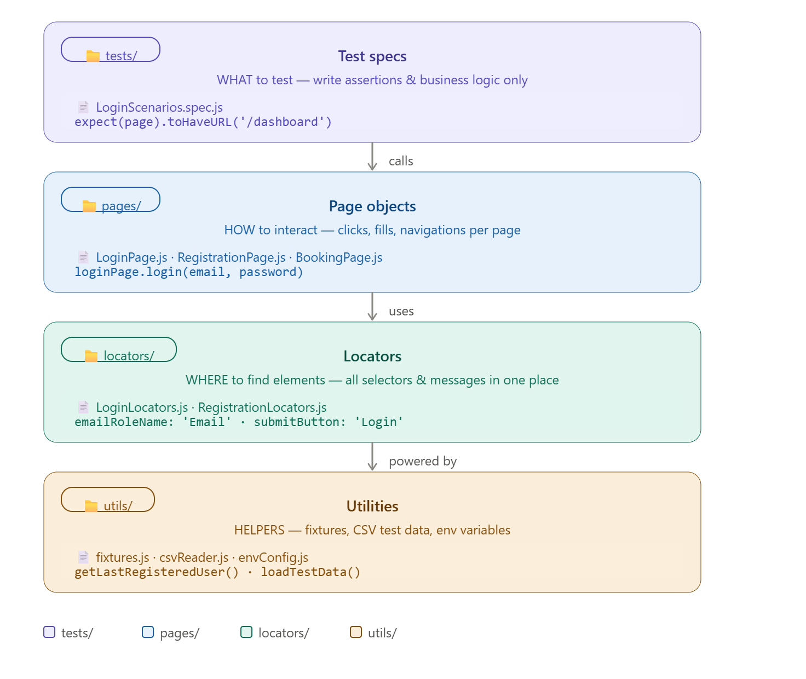
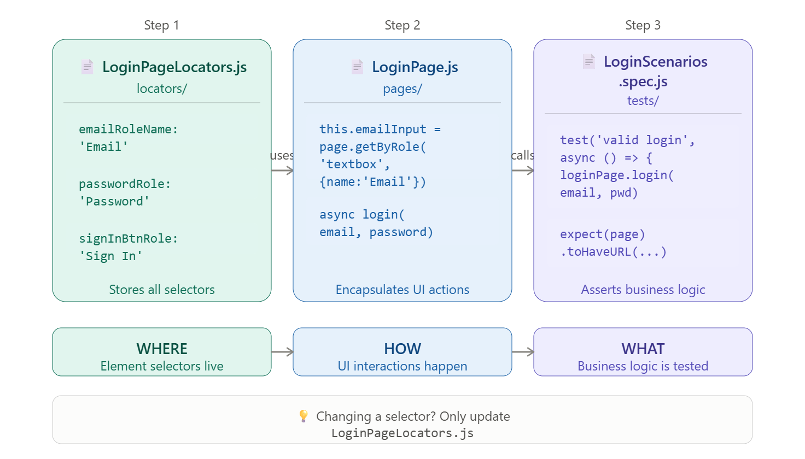
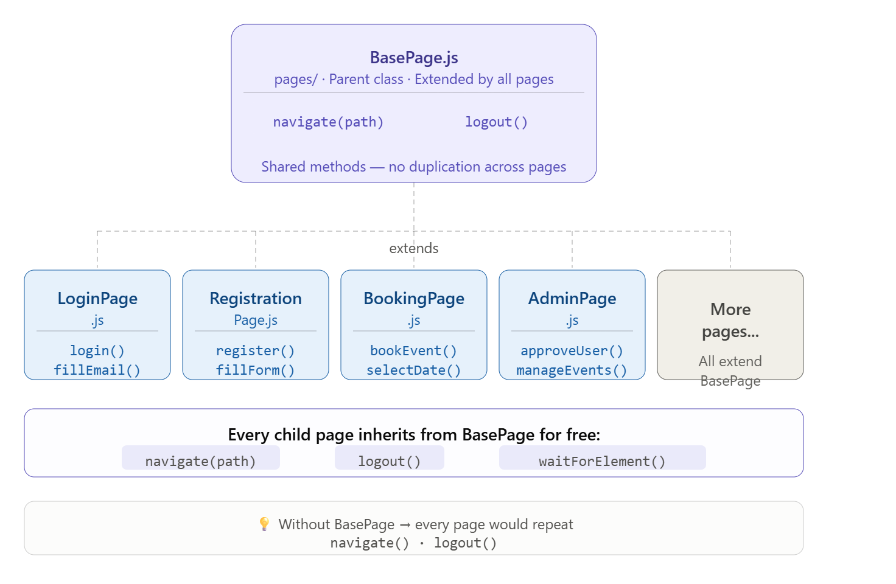
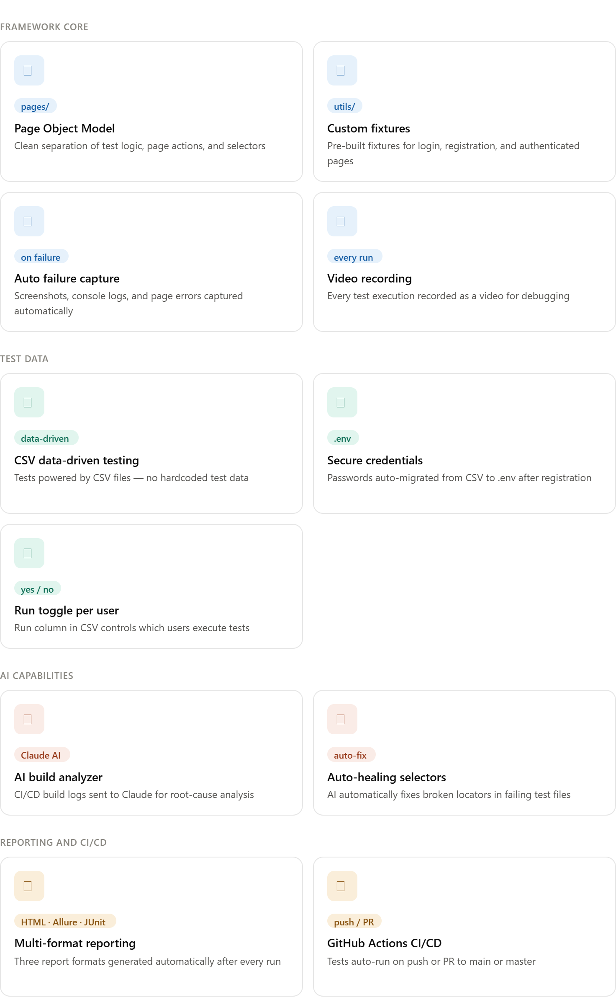
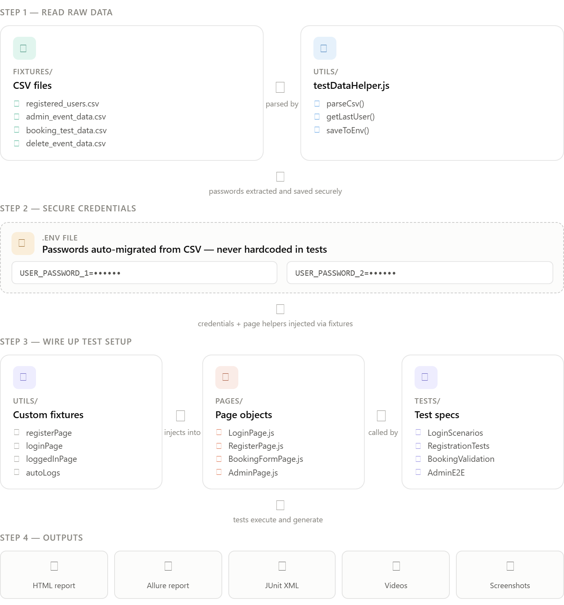
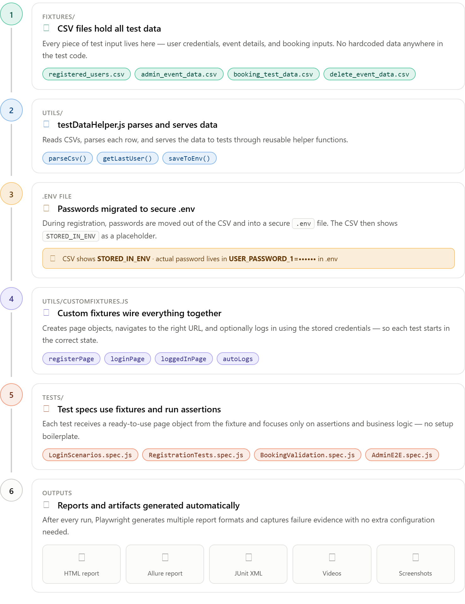
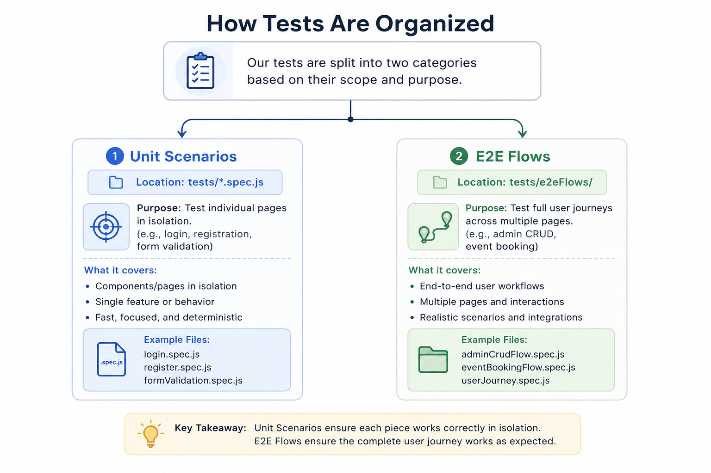
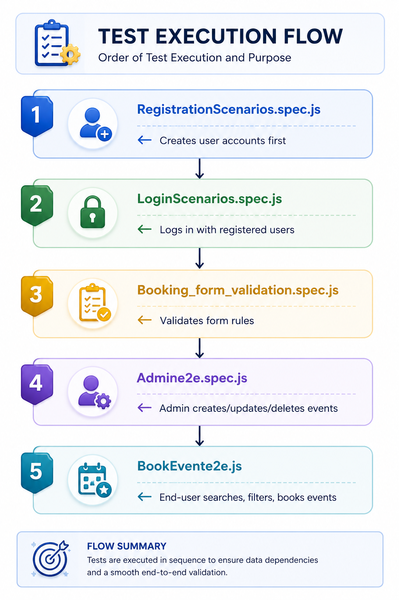
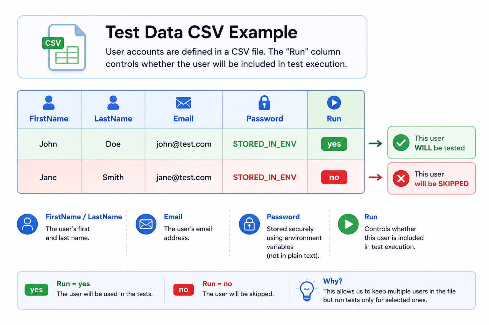
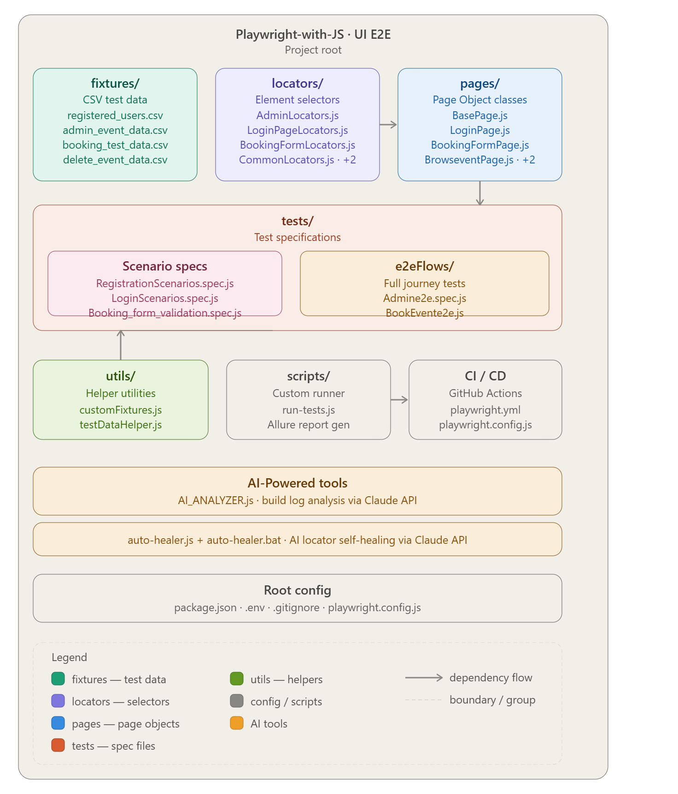

# 🎭 Playwright E2E UI Automation Framework

A production-ready **End-to-End (E2E) UI testing framework** built with **Playwright + JavaScript** for the [EventHub](https://eventhub.rahulshettyacademy.com) web application. It includes **AI-powered build analysis** and **auto-healing selectors** — making it one of the few frameworks that can diagnose failures and fix itself.

---

## Table of Contents

- [Framework Design Pattern](#-framework-design-pattern)
- [Features at a Glance](#-features-at-a-glance)
- [How Data Flows Through the Framework](#-how-data-flows-through-the-framework)
- [Test Case Orchestration](#-test-case-orchestration)
- [AI & Agentic Capabilities](#-ai--agentic-capabilities)
- [Project Structure](#-project-structure)
- [Getting Started](#-getting-started)
- [Running Tests](#-running-tests)
- [Reporting & Debugging](#-reporting--debugging)

---

## 🏗 Framework Design Pattern

This framework follows the **Page Object Model (POM)** with **Separated Locators** — a battle-tested design pattern used in the industry. Here's what that means in simple terms:

### What is POM and why do we use it?

Imagine your application has a Login page. Instead of writing selectors (`page.click('#loginBtn')`) inside every test, you create a **single class** called `LoginPage` that holds all the actions (click, fill, submit) for that page. Your tests then simply call `loginPage.login(email, password)`.

**Benefit:** If a button's selector changes tomorrow, you update it in **one place** (the Page Object), not in 50 tests.

### The 4 Layers



### How Page Objects Work (Example)



### BasePage — The Parent Class



## ✨ Features at a Glance


## 🔄 How Data Flows Through the Framework

This section explains how test data moves from CSV files → through helpers → into your tests → and produces results.


### Step-by-Step Data Flow



## 🎯 Test Case Orchestration

### How Tests Are Organized



### Execution Order

Tests run **sequentially** (not in parallel) because later tests depend on earlier ones:


> **Why sequential?** Registration creates users → Login uses those users → Admin creates events → Booking tests book those events. Each step depends on the previous one.

### The Run Toggle

In `registered_users.csv`, each user row has a `Run` column:


Set `Run` to `yes` or `no` (case-insensitive) to control which users are included in the test execution — no code changes needed.

### npm Scripts

| Command | What it runs |
|:--------|:-------------|
| `npm run test_registartion_e2e` | Registration tests (headed browser) |
| `npm run test_login_e2e` | Login tests (headed browser) |
| `npm run test_booking_form_validation` | Form validation tests (headed browser) |
| `npm run test_admin_e2e` | Admin CRUD flow (headed browser) |
| `npm run test_bookevent_e2e` | Event booking flow (headed browser) |
| `npm run test_all_endtoend` | All tests tagged `@endtoend` |
| `npm test` | Run everything |

### Custom Test Runner (`scripts/run-tests.js`)

All npm scripts go through a custom runner that:
1. Executes Playwright tests with the provided arguments
2. Waits for tests to complete
3. Automatically generates an **Allure report** from the results

---

## 🤖 AI & Agentic Capabilities

This framework includes two AI-powered tools that use the **Claude API** (Anthropic) to bring self-diagnosing and self-healing capabilities to your test pipeline.

### 1. AI Build Analyzer (`AI_ANALYZER.js`)

**What it does:** Takes a CI/CD build log and sends it to Claude AI for automated root-cause analysis.

**When to use it:** After a Jenkins/GitHub Actions build fails, instead of manually reading through 500 lines of logs.

**How it works:**

```
Build fails → Build log captured → AI_ANALYZER.js → Claude API → ai-analysis.txt
```

**Usage:**
```bash
node AI_ANALYZER.js <YOUR_API_KEY> "<build_log_text>"
```

**What you get** (saved to `ai-analysis.txt`):
- Root cause of failure (1-2 sentences)
- Step-by-step fix
- Prevention tips for the future

---

### 2. Auto-Healer (`auto-healer.js` + `auto-healer.bat`)

**What it does:** Reads a failing Playwright test file, sends it to Claude AI, and automatically fixes broken selectors/locators.

**When to use it:** When a test fails because a button ID, class name, or selector changed in the application.

**How it works:**

```
Test fails → auto-healer reads the .spec.js file
           → Sends code to Claude API
           → Claude returns fixed selectors
           → Original file backed up (.backup)
           → Fixed code written to the original file
           → healing-report.json created
```

**Usage (Windows batch file):**
```bash
auto-healer.bat <YOUR_API_KEY> tests\LoginScenarios.spec.js
```

**Usage (Node.js directly):**
```bash
node auto-healer.js <YOUR_API_KEY> tests/LoginScenarios.spec.js
```

**What it produces:**

| Output | Description |
|:-------|:------------|
| Fixed test file | The original `.spec.js` file, updated with resilient selectors |
| `.backup` file | A copy of your original code before any changes |
| `healing-report.json` | Timestamp, file name, and healing status |

**AI Healing Rules:**
- Only broken selectors/locators are changed — test logic stays untouched
- Prefers resilient selectors: `data-testid`, `role`, `text` over fragile CSS/XPath
- The original file is **always backed up** before overwriting

> **⚠️ Important:** Both AI tools require an [Anthropic API key](https://console.anthropic.com/). The API key is passed as a command-line argument and is never stored in the codebase.

---

## 📁 Project Structure



## 🚀 Getting Started

### Prerequisites

- [Node.js](https://nodejs.org/) v18 or higher
- An [Anthropic API key](https://console.anthropic.com/) (only needed for AI features)

### Installation

```bash
# 1. Clone the repository
git clone https://github.com/snehasengupta/Playwright-with-JS_-UI-E2E.git
cd Playwright-with-JS_-UI-E2E

# 2. Install dependencies
npm install

# 3. Install Playwright browsers
npx playwright install
```

### Environment Setup

A `.env` file is **auto-generated** when you run registration tests for the first time. It stores user passwords securely:

```env
# Auto-generated — do not commit this file
USER_PASSWORD_1=YourSecurePassword
USER_PASSWORD_2=AnotherPassword
```

> You do **not** need to create this file manually.

---

## 🏃 Running Tests

### Run Individual Test Suites

```bash
# Registration tests (opens browser window)
npm run test_registartion_e2e

# Login tests
npm run test_login_e2e

# Booking form validation
npm run test_booking_form_validation

# Admin CRUD flow
npm run test_admin_e2e

# Event booking flow
npm run test_bookevent_e2e

# All end-to-end tests
npm run test_all_endtoend

# Run everything
npm test
```

### Run with Playwright CLI

```bash
# All tests (headless)
npx playwright test

# Specific test file
npx playwright test tests/LoginScenarios.spec.js

# Interactive UI mode
npx playwright test --ui

# Headed mode (see the browser)
npx playwright test --headed
```

### Run AI Tools

```bash
# Analyze a build failure
node AI_ANALYZER.js <API_KEY> "<paste_build_log_here>"

# Auto-heal a failing test
auto-healer.bat <API_KEY> tests\LoginScenarios.spec.js
```

---

## 📊 Reporting & Debugging

### Available Report Formats

| Report | Generated By | How to View |
|:-------|:-------------|:------------|
| **HTML Report** | Playwright built-in | `npx playwright show-report` |
| **Allure Report** | allure-playwright plugin | `npm run allure:serve` |
| **JUnit XML** | Playwright JUnit reporter | Open `test-results/results.xml` in any CI tool |

### Auto-Captured Failure Artifacts

When a test fails, the `autoLogsAndScreenshots` fixture **automatically** captures:

- 📸 **Full-page screenshot** of the failure state
- 📋 **Browser console logs** (errors, warnings, info)
- 🐛 **Page errors** (unhandled JavaScript exceptions)
- 🎬 **Video recording** of the entire test execution

All artifacts are attached to the HTML/Allure report — no extra configuration needed.

### Viewing Reports

```bash
# Open Playwright HTML report
npx playwright show-report

# Generate and open Allure report
npm run allure:generate
npm run allure:open

# Or serve Allure report directly
npm run allure:serve
```

> **Tip:** Test videos are saved in `test-results/`, and HTML reports are generated in `playwright-report/`.

---

## 🔗 CI/CD Integration

The framework includes a **GitHub Actions** workflow (`.github/workflows/playwright.yml`) that:

1. Triggers on every **push** or **pull request** to `main`/`master`
2. Sets up Node.js and installs dependencies
3. Installs Playwright browsers
4. Runs all tests in headless mode
5. Uploads the HTML report as a **build artifact** (retained for 30 days)

---

## 📝 Quick Reference for New QA Engineers

| I want to... | Do this |
|:-------------|:--------|
| Add a new test | Create a `.spec.js` file in `tests/` |
| Add a new page object | Create a class in `pages/` extending `BasePage` |
| Add/change a selector | Edit the corresponding file in `locators/` |
| Add a new test user | Add a row to `fixtures/registered_users.csv` |
| Skip a test user | Set `Run` to `no` in the CSV |
| Debug a failure | Check the HTML report: `npx playwright show-report` |
| Fix broken selectors with AI | Run `auto-healer.bat <KEY> <file>` |
| Understand why a build failed | Run `node AI_ANALYZER.js <KEY> "<log>"` |
