# 🎭 Playwright E2E UI Automation Framework

A production-ready **End-to-End (E2E) UI testing framework** built with **Playwright + JavaScript** for the [EventHub](https://eventhub.rahulshettyacademy.com) web application. It includes **AI-powered self-healing and root-cause analysis capabilities**.

---

## Table of Contents

- [Framework Design Pattern](#-framework-design-pattern)
- [Features at a Glance](#-features-at-a-glance)
- [How Data Flows Through the Framework](#-how-data-flows-through-the-framework)
- [Test Case Orchestration](#-test-case-orchestration)
- [AI & Agentic Capabilities](#-ai--agentic-capabilities)
- [Project Structure](#-project-structure)
- [Getting Started](#-getting-started)
- [Running Tests](#-running-tests)
- [Reporting & Debugging](#-reporting--debugging)

---

## 🏗 Framework Design Pattern

This framework follows the **Page Object Model (POM)** with **Separated Locators** — a battle-tested design pattern used in the industry. Here's what that means in simple terms:

### What is POM and why do we use it?

Imagine your application has a Login page. Instead of writing selectors (`page.click('#loginBtn')`) inside every test, you create a **single class** called `LoginPage` that holds all the actions and selectors in one place.

**Benefit:** If a button's selector changes tomorrow, you update it in **one place** (the Page Object), not in 50 tests.

### The 4-Layer Architecture

The framework is organized into 4 distinct layers, each with a specific responsibility:

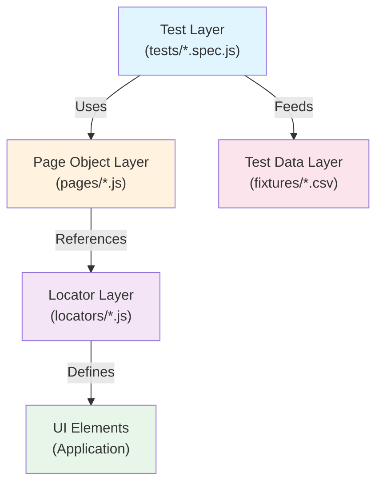

**Layer Breakdown:**

1. **Test Layer** (`tests/`)
   - Contains all test specifications (`.spec.js` files)
   - Examples: `RegistrationScenarios.spec.js`, `LoginScenarios.spec.js`, `e2eFlows/BookEvente2e.js`
   - Focuses on **what to test** and **expected outcomes**

2. **Page Object Layer** (`pages/`)
   - Contains page classes that encapsulate UI actions
   - Examples: `BasePage.js`, `RegisterPage.js`, `LoginPage.js`, `BrowseventPage.js`, `AdminPage.js`
   - Focuses on **how to interact with the UI**
   - All page classes extend `BasePage` for common functionality

3. **Locator Layer** (`locators/`)
   - Contains all CSS selectors, test IDs, and XPath locators
   - Examples: `CommonLocators.js`, `RegisterPageLocators.js`, `LoginPageLocators.js`
   - Focuses on **where to find elements**
   - Separates selectors from logic for easy maintenance

4. **Test Data Layer** (`fixtures/`)
   - CSV files with test data
   - Examples: `registered_users.csv`, `booking_test_data.csv`, `admin_event_data.csv`
   - Focuses on **what data to use** for testing

### How Page Objects Work (Example)

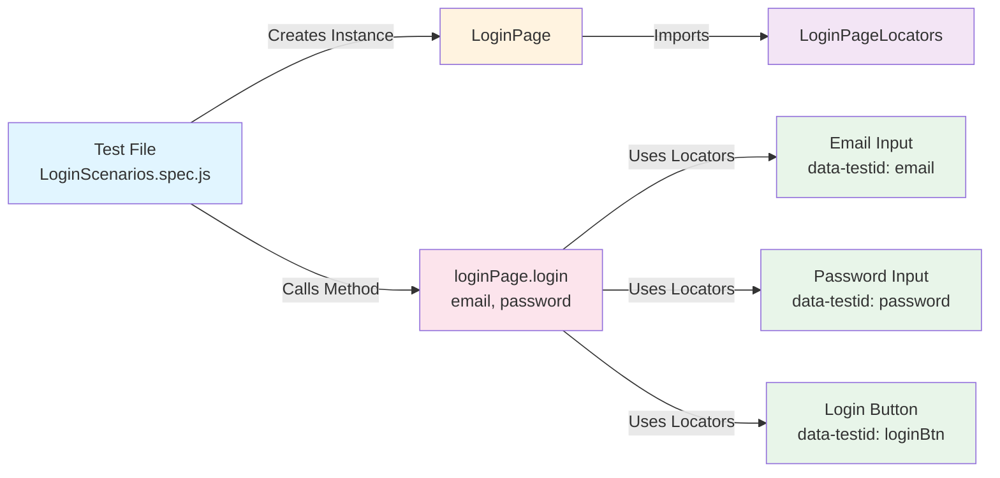

**What happens behind the scenes:**
- Test calls `loginPage.login(email, password)`
- LoginPage retrieves selectors from `LoginPageLocators`
- Page Object fills email and password fields using selectors
- Page Object clicks the login button
- Test verifies the result (e.g., featured events heading is visible)

### BasePage — The Parent Class

The `BasePage.js` class provides common functionality for all page objects:

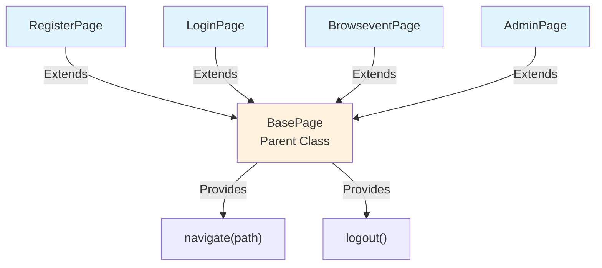

**Common Methods in BasePage:**
- `navigate(path)` — Navigate to a URL path (e.g., `/login`)
- `logout()` — Logout functionality using common logout button locator

---

## ✨ Features at a Glance

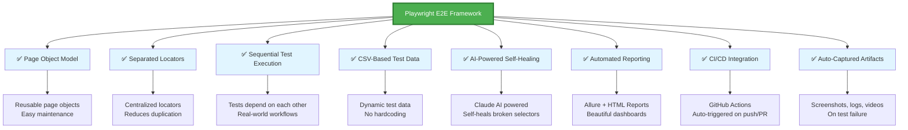

---

## 🔄 How Data Flows Through the Framework

This section explains how test data moves from CSV files → through helpers → into your tests → and produces results.

```mermaid
graph LR
    A["CSV Files<br/>fixtures/"] -->|Read| B["Test Data Helper<br/>testDataHelper.js"]
    B -->|Parse & Filter| C["Test Runner<br/>scripts/run-tests.js"]
    C -->|Provide Data| D["Test Specs<br/>tests/*.spec.js"]
    D -->|Interact via| E["Page Objects<br/>pages/*.js"]
    E -->|Use| F["Locators<br/>locators/*.js"]
    F -->|Find & Act| G["Browser<br/>Application"]
    G -->|Results| H["Playwright Reporter"]
    H -->|Generate| I["Allure Report<br/>HTML Report<br/>JUnit XML"]
    
    style A fill:#fce4ec
    style B fill:#f3e5f5
    style C fill:#e0f2f1
    style D fill:#e1f5ff
    style E fill:#fff3e0
    style F fill:#f3e5f5
    style G fill:#e8f5e9
    style H fill:#ffe0b2
    style I fill:#c8e6c9
```

### Step-by-Step Data Flow

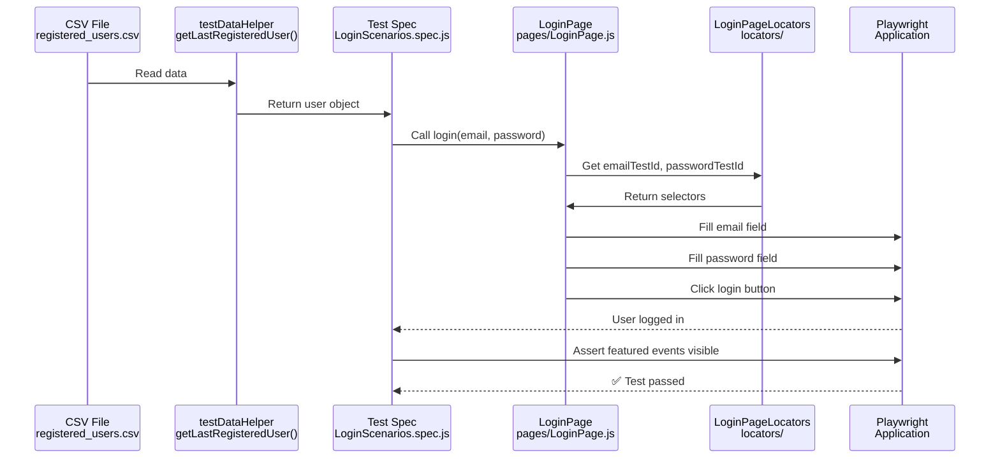

---

## 🎯 Test Case Orchestration

### How Tests Are Organized

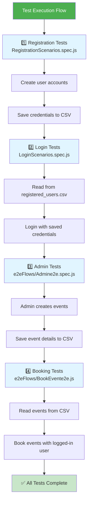

### Execution Order

Tests run **sequentially** (not in parallel) because later tests depend on earlier ones:

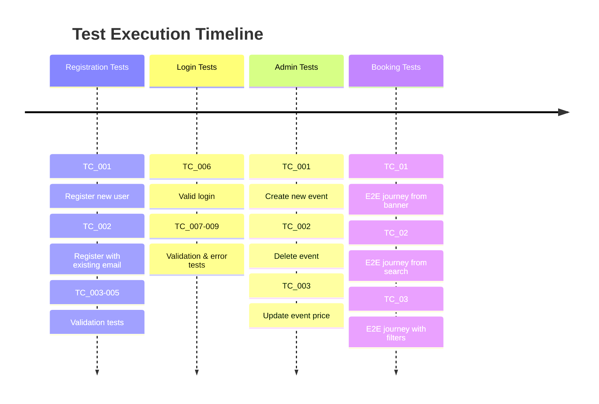

> **Why sequential?** Registration creates users → Login uses those users → Admin creates events → Booking tests book those events. Each step depends on the previous one.

### The Run Toggle

In `registered_users.csv`, each user row has a `Run` column:

```csv
"Run","Email","Password","final Password"
"No","user_kqq0vi27_mqgvk2jd@test.com","STORED_IN_ENV","STORED_IN_ENV"
"yes","user_r35g07yd_mqt1e7xt@test.com","STORED_IN_ENV","STORED_IN_ENV"
"yes","user_0n0johlg_mqussz08@test.com","STORED_IN_ENV","STORED_IN_ENV"
```

Set `Run` to `yes` or `no` (case-insensitive) to control which users are included in the test execution — **no code changes needed**.

### npm Scripts

| Command | What it runs |
|:--------|:-------------|
| `npm run test_registartion_e2e` | Registration tests (headed browser) |
| `npm run test_login_e2e` | Login tests (headed browser) |
| `npm run test_admin_e2e` | Admin CRUD flow (headed browser) |
| `npm run test_bookevent_e2e` | Event booking flow (headed browser) |
| `npm run test_all_endtoend` | All tests tagged `@endtoend` |
| `npm test` | Run everything |
| `npm run heal` | Run Smart Auto-Healer to automatically fix failing tests |
| `npm run heal:dry-run` | Run Smart Auto-Healer in dry-run mode (no file modifications) |

### Custom Test Runner (`scripts/run-tests.js`)

All npm scripts go through a custom runner that:
1. Executes Playwright tests with the provided arguments
2. Waits for tests to complete
3. Automatically generates an **Allure report** from the results

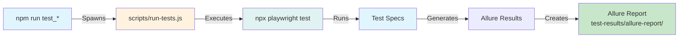

---

## 🤖 AI & Agentic Capabilities

This framework includes two AI-powered tools that use the **Claude API** (Anthropic) to bring self-diagnosing and self-healing capabilities to your test pipeline.

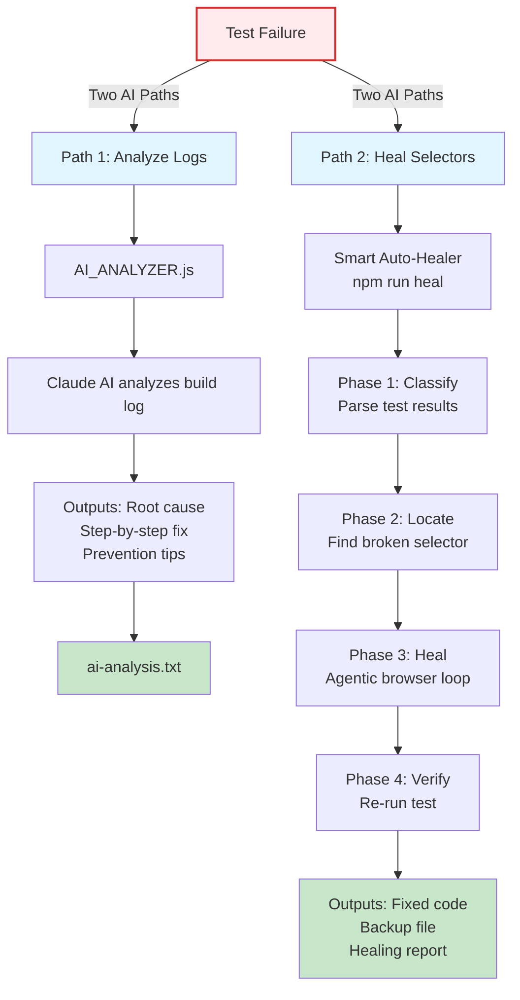

### 1. AI Build Analyzer (`AI_ANALYZER.js`)

**What it does:** Takes a CI/CD build log and sends it to Claude AI for automated root-cause analysis.

**When to use it:** After a Jenkins/GitHub Actions build fails, instead of manually reading through 500 lines of logs.

**How it works:**

```
Build fails → Build log captured → AI_ANALYZER.js → Claude API → ai-analysis.txt
```

**Usage:**
```bash
node AI_ANALYZER.js <YOUR_API_KEY> "<build_log_text>"
```

**What you get** (saved to `ai-analysis.txt`):
- Root cause of failure (1-2 sentences)
- Step-by-step fix
- Prevention tips for the future

---

### 2. Smart Auto-Healer (`npm run heal` or `scripts/smart-healer.js`)

**What it does:** Automatically classifies test failures, locates broken selectors from the error stack trace, uses an agentic browser loop powered by Claude to find the working selector, applies fixes, and verifies the fix works.

**When to use it:** When tests fail due to selector/locator changes or timeouts.

**How it works:**

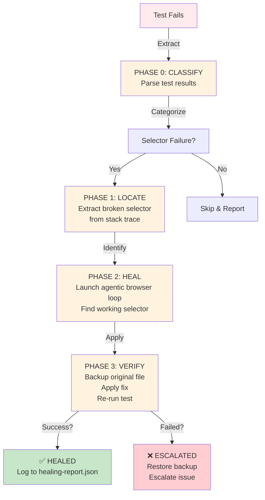

**Usage (using npm script):**
```bash
npm run heal
```

**Usage (using npm script with dry-run):**
```bash
npm run heal:dry-run
```

**Usage (Node.js directly):**
```bash
node scripts/smart-healer.js <YOUR_API_KEY> [options]
```

**Available Options:**
- `--dry-run`: Runs the full agentic loop without making any modifications to the files.
- `--max-heal <number>`: Limit the maximum number of healing attempts (defaults to 3).

**What it produces:**

| Output | Description |
|:-------|:------------|
| Fixed file | The original `.spec.js` or locator file, updated with resilient selectors |
| `.backup.<timestamp>` file | A copy of your original code before changes were applied |
| `healing-report.json` | Rolling log of healing status, selector history, and attempts |

**AI Healing Rules:**
- Only broken selectors/locators are changed — test logic stays untouched
- Prefers resilient selectors: `data-testid`, `role`, `text` over fragile CSS/XPath
- The original file is **always backed up** before overwriting
- Verification re-runs the specific test to confirm the fix actually works

> **⚠️ Important:** Both AI tools require an [Anthropic API key](https://console.anthropic.com/). The API key is passed as a command-line argument or stored in the `.env` file as `ANTHROPIC_API_KEY`, and is never hardcoded in the codebase.

---

## 📁 Project Structure

```
Playwright-with-JS_-UI-E2E/
│
├── tests/                              # Test Specifications
│   ├── RegistrationScenarios.spec.js   # User registration tests (TC_001 - TC_005)
│   ├── LoginScenarios.spec.js          # Login & validation tests (TC_006 - TC_009)
│   └── e2eFlows/                       # End-to-end flow tests
│       ├── BookEvente2e.js             # Event booking workflows (TC_01 - TC_03)
│       └── Admine2e.spec.js            # Admin event management (TC_001 - TC_003)
│
├── pages/                              # Page Objects (POM Layer)
│   ├── BasePage.js                     # Parent class with common methods
│   ├── RegisterPage.js                 # User registration page object
│   ├── LoginPage.js                    # Login page object
│   ├── BrowseventPage.js               # Event browsing & booking page object
│   └── Adminpage.js                    # Admin management page object
│
├── locators/                           # Locators (Selector Layer)
│   ├── CommonLocators.js               # Shared locators (logout button, etc.)
│   ├── RegisterPageLocators.js         # Registration page selectors
│   ├── LoginPageLocators.js            # Login page selectors
│   ├── BrowseventLocators.js           # Event page selectors
│   └── AdminLocators.js                # Admin page selectors
│
├── fixtures/                           # Test Data (CSV Files)
│   ├── registered_users.csv            # Users created during registration
│   ├── booking_test_data.csv           # Booking test data
│   └── admin_event_data.csv            # Admin event creation data
│
├── utils/                              # Utilities & Helpers
│   ├── customFixtures.js               # Playwright fixtures & auto-logging
│   └── testDataHelper.js               # CSV parsing & test data helpers
│
├── scripts/                            # Automation Scripts
│   ├── run-tests.js                    # Custom test runner + Allure report generator
│   ├── smart-healer.js                 # AI-powered self-healing orchestrator
│   └── healer/                         # Smart-healer modules
│       ├── result-parser.js            # Parse & classify test failures
│       ├── stack-analyzer.js           # Extract selectors from stack traces
│       ├── healing-agent.js            # Agentic browser loop with Claude
│       └── email-notifier.js           # Escalation notifications
│
├── playwright.config.js                # Playwright configuration
├── package.json                        # Dependencies & npm scripts
├── .github/
│   └── workflows/
│       └── playwright.yml              # GitHub Actions CI/CD workflow
│
└── .gitignore                          # Ignore .env and test results
```

**Directory Breakdown:**

```mermaid
graph TB
    A["Project Root"] 
    
    A --> B["tests/"]
    B --> B1["Spec files"]
    B1 --> B2["RegistrationScenarios.spec.js"]
    B1 --> B3["LoginScenarios.spec.js"]
    B1 --> B4["e2eFlows/BookEvente2e.js"]
    B1 --> B5["e2eFlows/Admine2e.spec.js"]
    
    A --> C["pages/"]
    C --> C1["Page Objects"]
    C1 --> C2["BasePage.js"]
    C1 --> C3["RegisterPage.js"]
    C1 --> C4["LoginPage.js"]
    
    A --> D["locators/"]
    D --> D1["Selector Files"]
    D1 --> D2["CommonLocators.js"]
    D1 --> D3["RegisterPageLocators.js"]
    D1 --> D4["LoginPageLocators.js"]
    
    A --> E["fixtures/"]
    E --> E1["CSV Files"]
    E1 --> E2["registered_users.csv"]
    E1 --> E3["booking_test_data.csv"]
    
    A --> F["utils/"]
    F --> F1["customFixtures.js"]
    F --> F2["testDataHelper.js"]
    
    A --> G["scripts/"]
    G --> G1["run-tests.js"]
    G --> G2["smart-healer.js"]
    
    style A fill:#4CAF50,color:#fff
    style B fill:#e1f5ff
    style C fill:#fff3e0
    style D fill:#f3e5f5
    style E fill:#fce4ec
    style F fill:#ede7f6
    style G fill:#e0f2f1
```

---

## 🚀 Getting Started

### Prerequisites

- [Node.js](https://nodejs.org/) v18 or higher
- An [Anthropic API key](https://console.anthropic.com/) (only needed for AI features)

### Installation

```bash
# 1. Clone the repository
git clone https://github.com/snehasengupta/Playwright-with-JS_-UI-E2E.git
cd Playwright-with-JS_-UI-E2E

# 2. Install dependencies
npm install

# 3. Install Playwright browsers
npx playwright install
```

### Environment Setup

Create a `.env` file in the project root to store sensitive data (optional but recommended for API keys):

```env
# Optional — for Anthropic API key (only needed for AI features)
ANTHROPIC_API_KEY=your-api-key-here

# Auto-generated during test runs — stores test user passwords
USER_PASSWORD_1=YourSecurePassword
USER_PASSWORD_2=AnotherPassword
```

> **Note:** The `.env` file should never be committed to version control. It is added to `.gitignore` by default.

---

## 🏃 Running Tests

### Run Individual Test Suites

```bash
# Registration tests (opens browser window)
npm run test_registartion_e2e

# Login tests
npm run test_login_e2e

# Admin CRUD flow
npm run test_admin_e2e

# Event booking flow
npm run test_bookevent_e2e

# All end-to-end tests
npm run test_all_endtoend

# Run everything
npm test
```

### Run with Playwright CLI

```bash
# All tests (headless)
npx playwright test

# Specific test file
npx playwright test tests/LoginScenarios.spec.js

# Interactive UI mode
npx playwright test --ui

# Headed mode (see the browser)
npx playwright test --headed
```

### Run AI Tools

```bash
# Analyze a build failure
node AI_ANALYZER.js <API_KEY> "<paste_build_log_here>"

# Run Smart Auto-Healer to automatically fix failing tests
npm run heal

# Or with specific options
node scripts/smart-healer.js <API_KEY> --dry-run --max-heal 5
```

---

## 📊 Reporting & Debugging

### Available Report Formats

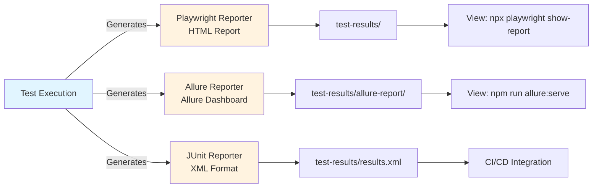

| Report | Generated By | How to View |
|:-------|:-------------|:------------|
| **HTML Report** | Playwright built-in | `npx playwright show-report` |
| **Allure Report** | allure-playwright plugin | `npm run allure:serve` |
| **JUnit XML** | Playwright JUnit reporter | Open `test-results/results.xml` in any CI tool |

### Auto-Captured Failure Artifacts

When a test fails, the `autoLogsAndScreenshots` fixture **automatically** captures:

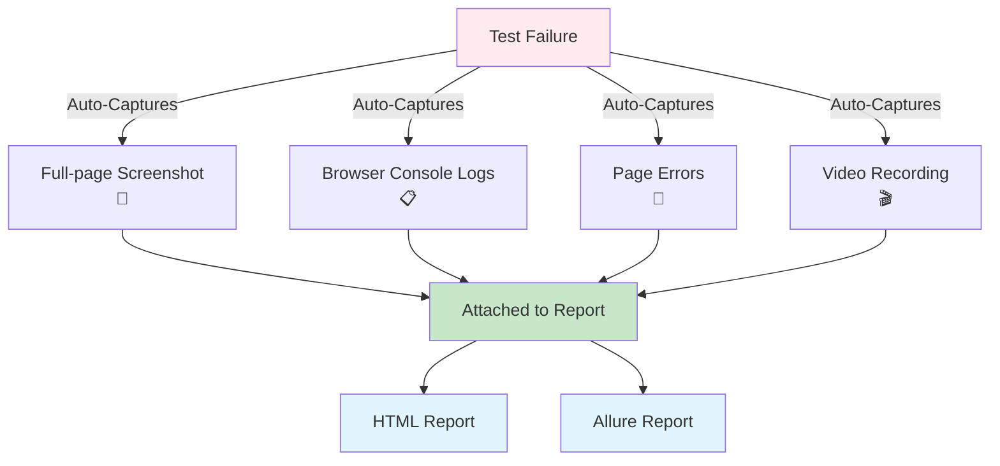

- 📸 **Full-page screenshot** of the failure state
- 📋 **Browser console logs** (errors, warnings, info)
- 🐛 **Page errors** (unhandled JavaScript exceptions)
- 🎬 **Video recording** of the entire test execution

All artifacts are attached to the HTML/Allure report — no extra configuration needed.

### Viewing Reports

```bash
# Open Playwright HTML report
npx playwright show-report

# Generate and open Allure report
npm run allure:generate
npm run allure:open

# Or serve Allure report directly
npm run allure:serve
```

> **Tip:** Test videos are saved in `test-results/`, and HTML reports are generated in `playwright-report/`.

---

## 🔗 CI/CD Integration

The framework includes a **GitHub Actions** workflow (`.github/workflows/playwright.yml`) that:

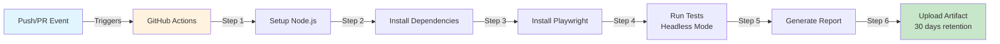

1. Triggers on every **push** or **pull request** to `main`/`master`
2. Sets up Node.js and installs dependencies
3. Installs Playwright browsers
4. Runs all tests in headless mode
5. Uploads the HTML report as a **build artifact** (retained for 30 days)

---

## 📝 Quick Reference for New QA Engineers

| I want to... | Do this |
|:-------------|:--------|
| Add a new test | Create a `.spec.js` file in `tests/` |
| Add a new page object | Create a class in `pages/` extending `BasePage` |
| Add/change a selector | Edit the corresponding file in `locators/` |
| Add a new test user | Add a row to `fixtures/registered_users.csv` |
| Skip a test user | Set `Run` to `no` in the CSV |
| Debug a failure | Check the HTML report: `npx playwright show-report` |
| Fix broken selectors with AI | Run `npm run heal` |
| Understand why a build failed | Run `node AI_ANALYZER.js <KEY> "<log>"` |
| Run tests in UI mode | Run `npx playwright test --ui` |
| View Allure dashboard | Run `npm run allure:serve` |
