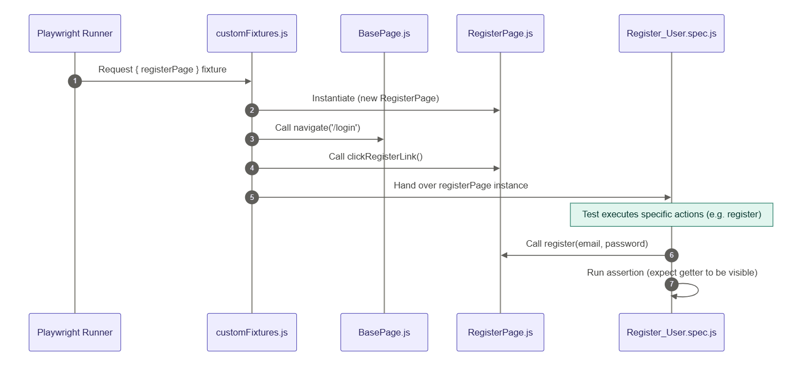
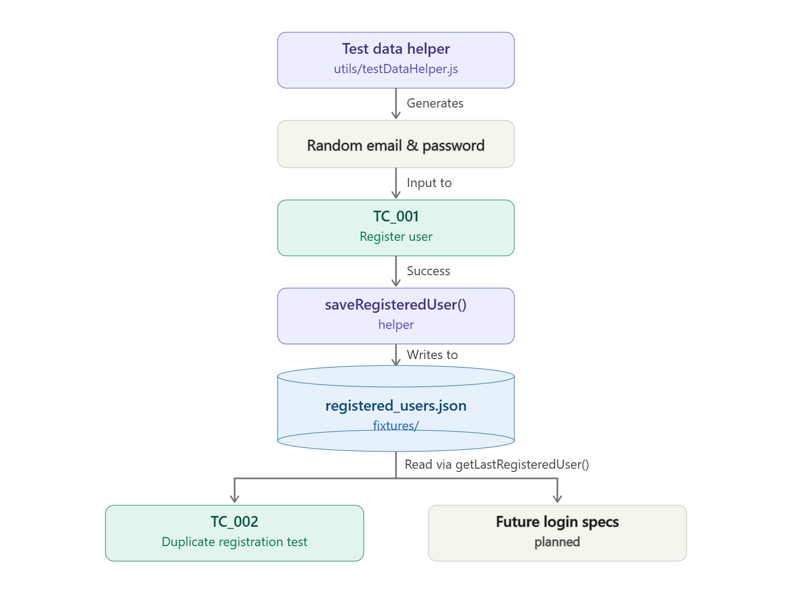

# Playwright E2E UI Automation Framework

This repository contains an End-to-End (E2E) UI automation testing framework built using **Playwright** and **JavaScript** for the EventHub application.

It is designed using best practices in test automation:
* **Page Object Model (POM):** Decouples UI structure and actions from test logic.
* **Centralized Locators:** Selectors and validation messages are kept separate from code for easy maintenance.
* **Custom Playwright Fixtures:** Automatically handles page instantiation and navigation setups in the background.
* **Getters for Assertions:** Spec files contain direct assertions, but keep locator elements encapsulated inside page objects.

---

## 📋 Registration Test Cases

The registration flow (`tests/e2eFlows/Register_User.spec.js`) validates user onboarding behavior:


---

## 🔄 Test Execution & Navigation Flow

Playwright uses **Custom Fixtures** to automate page instantiation and navigation before entering each test. This keeps tests clean and avoids repeating `page.goto` setup calls.


---

## 💾 Test Data Flow

To ensure tests can run independently and sequentially, we dynamically generate user credentials, store them, and reuse them across different tests:



1. **Generation:** `testDataHelper.js` generates unique random credentials.
2. **Persistence:** `TC_001` registers a fresh user and writes the credentials to `registered_users.json`.
3. **Consumption:** `TC_002` (and future login tests) fetch the last registered user from the JSON database to verify validation and login flows.

---

## 🚀 Getting Started

### 1. Install Dependencies
```bash
npm install
```

### 2. Run Registration Tests
To run the registration spec in headed mode:
```bash
npm run test_registartion_e2e
```
